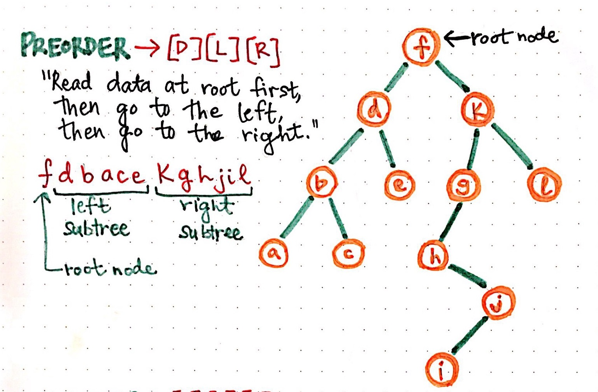

# Emplug
<h1> An Algorithm for Traversing a Tree - Depth-first (DFS) </h1> 

<b>Basic Terminologies</b>
<b>Tree</b>
Trees are one of the most commonly used data structures in web development. This statement holds true for both developers and users. Every web developer who has written HTML and loaded it into a web browser has created a tree, which is referred to as the Document Object Model (DOM). Every user of the Internet who has, in turn, consumed information on the Internet has received it in the form of a tree—the DOM. 

<b>A formal definition is in order.</b> 
In computer science, a <b>tree</b> is a widely used abstract data type (ADT)—or data structure implementing this ADT—that simulates a hierarchical tree structure, with a root value and subtrees of children with a parent node, represented as a set of linked nodes. 
Each node of a tree holds its own data and pointers to other nodes. 

I'll compare a <b>tree</b> to an organizational chart. The chart has a top-level position (root node), such as the President. Directly underneath this position are other positions, such as vice president (VP) and Chief Technology Officer (CTO) that are directly reporting to the President or are descendants (children) of the President. 
To create more children (nodes) or relationships in our organizational chart, we just repeat this process—we have a node point to another node. 
The top-most node (or the node with no ‘parent’ node) is called the root. The bottom-most node(s) (or nodes with no child nodes), are called leaves. Nodes with both a parent node and any child nodes are called branches as shown below:  

<b>Algorithm</b> 

An <b>algorithm</b> is a set of steps we apply to complete a particular task or computation. 
It is basically a procedure or formula for solving a problem, based on conducting a sequence of specified actions, and which (like a map or flowchart) will lead to the sought result if followed.

<strong>Traversal</strong> 
<b>Traversal</b> is a process or method or strategy used to visit all the nodes of a tree and may print their values too. In a
traversal, the goal is for the algorithm to visit all the nodes in the tree in some order and perform an operation on them. The most basic traversal simply enumerates the nodes so that you can see their ordering in the traversal. 
There are three common ways to traverse a <b>tree</b> in depth-first order: in-order, pre-order and post-order. 
Traversing a tree depth-first means that we’ll first visit our ‘deepest’ or ‘lowest’ nodes, or the search tree is deepened as much as possible on each child before going to the next sibling and ultimately visit our root node by backtracking 

This means that in depth-first search, once we start down a path, we don’t stop until we get to the end. In other words, we traverse through one branch of a tree until we get to a leaf, and then we work our way back to the trunk of the tree.

@marvambi :cop: 

The order in which we visit nodes while traversing a tree is important. The order of traversal is how we classify the different traversal algorithms

We'll be specifically looking at this application for a binary search tree as:  
-   Read the data of the node that we’re checking or updating.
-   Check the node to the left of the node (the left reference) that we’re on currently if it exist.
-   Check the node to the right of the node (the left reference) that we’re on currently if it exist.

The different depth-first strategies all revolve around the order in which we do these three things. 
We will be focusing on one of the strategies here, in this case, I'll dwell on pre-order strategy which is the first strategy illustrate in the image below. 

Thus, the modified <b>Pre-order depth-first search</b> is as follows:

- Check if the current node is empty / null.
- Display the data part of the root (or current node).
- Traverse the left subtree by recursively calling the pre-order function.
- Traverse the right subtree by recursively calling the pre-order function.  

The image below shows the output of this pre-order algorithm applied to a 12-node binary tree:

 
